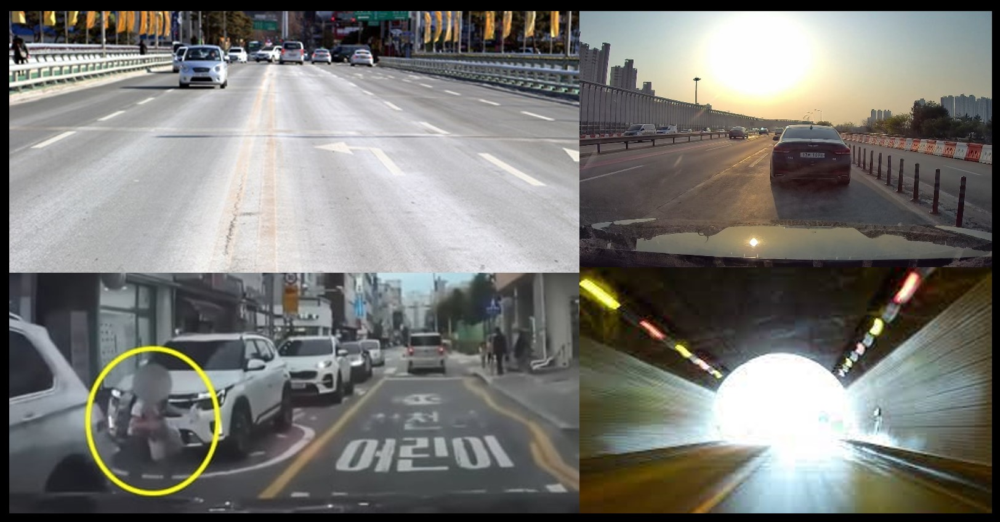

Research Title: Development of Safety of the Intended Functionality from Insufficiency of Perception and Decision Making

Sponsor: Ministry of Trade, Industry and Energy

Participating Institutions: KATECH (lead), HL Klemove, MORAI, SUM, C&BIS, KMU, AJU, KAAMI
 * Participated as a researcher at KATECH (Korea Automotive Technology Institute)

Research Period: 2022. 04. 01 - 2026. 12. 31
Participation Period: 2023. 09. 01 - 2024. 05. 23

Keywords: SOTIF, misuse, performance limitation

Research Goal: Development of Level 4 autonomous driving system considering SOTIF (Safety of the Intended Functionality)

Research Introduction:
This study addresses "risk situations caused by performance limitations rather than failures" in the context of Level 4 autonomous driving systems.
Performance limitations refer to situations that can arise when a system (or its components) combines weaknesses or limitations with specific conditions, without any faults or failures.
This concept is referred to as "Safety of the Intended Functionality" or "SOTIF".
Situations related to SOTIF include "system performance limitations" and "driver misuse".
For example, among the perception sensors of an autonomous driving system, cameras can be vulnerable to lighting and optical conditions, leading to risks due to performance limitations in backlight situations. Additionally, radar sensors can be sensitive to resolution and detection conditions. Due to these weaknesses, performance limitations may lead to the system failing to detect small objects or objects closely adjacent to each other, causing potential risks.
Furthermore, a performance limitation situation due to driver misuse could involve a scenario where the autonomous driving system provides a control handover alert to the driver in a situation requiring control handover (not Level 4), but the driver, wearing headphones and sleeping, fails to notice the alert, leading to a dangerous situation.
The ultimate goal of this research is to develop a safer system compared to existing autonomous driving systems by designing safety measures that consider SOTIF scenarios. Safety measure design strategies under review include "limiting system operating range in specific situations," "sensor fusion," and "sensor cleaning.